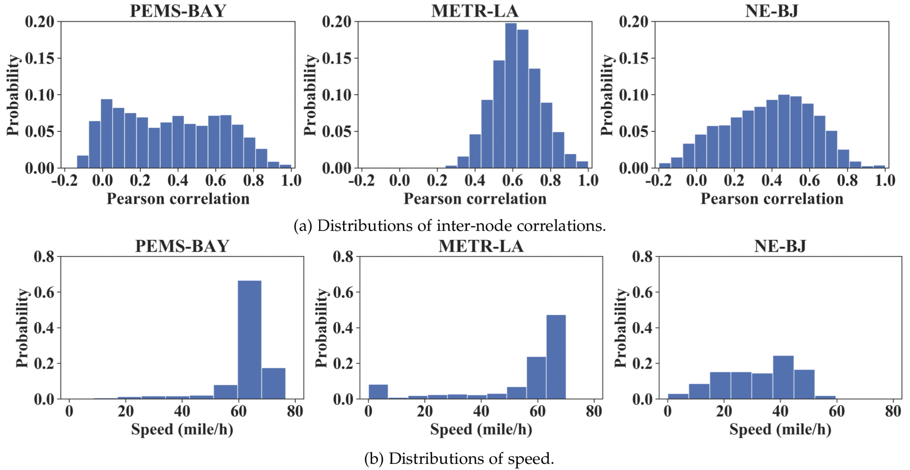
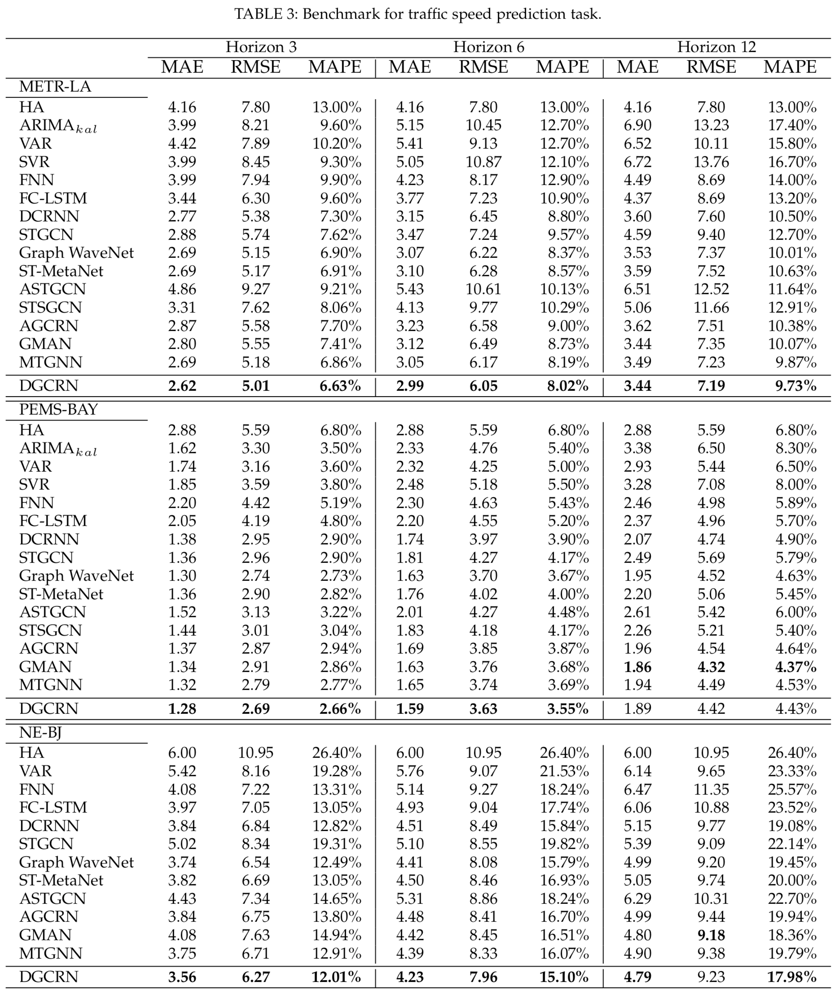

@@ -40,50 +40,62 @@ pip install -r requirements.txt
- The description of METR-LA dataset and PEMS_BAY dataset please refers to the repository of [DCRNN](https://github.com/liyaguang/DCRNN).

- The NE-BJ dataset used in the paper can be downloaded, which will be available soon.

<p align="center">

<br><br>
<b>Figure 3.</b> Road segment distribution of the NE-BJ dataset.
</p>

<p align="center">

<br><br>
<b>Figure 4.</b> Comparisons among datasets.
</p>

## Usage
Commands for training model:

```bash
python train_benchmark.py --model 'model_name' --data 'data_name' >> log.txt 
```

More parameter information can be found in `train_benchmark.py` or the file in the directory of corrsponding model. You can refer to these parameters for experiments, and you can also adjust the parameters to obtain better results.

### Custom data preparation

The repository includes a small example dataset under `data/` (`distance.csv` and
`trait.csv`).  Run the helper script below to convert these files into the
standard training format used by the models.  The processed files will be placed
in `data/custom/`.

```bash
python prepare_dataset.py
```


## <span id="resultslink">Results</span> 

<p align="center">

<br><br>
<b>Figure 5.</b>  Results of benchmark.
</p>


## <span id="citelink">Citation</span>
If you find this repository useful in your research, please consider citing the following paper:

```
@misc{li2021dynamic,
      title={Dynamic Graph Convolutional Recurrent Network for Traffic Prediction: Benchmark and Solution}, 
      author={Fuxian Li and Jie Feng and Huan Yan and Guangyin Jin and Depeng Jin and Yong Li},
      year={2021},
      eprint={2104.14917},
      archivePrefix={arXiv},
      primaryClass={cs.LG}
}
```
